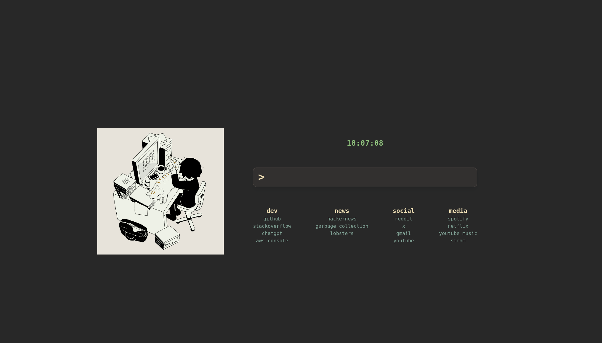
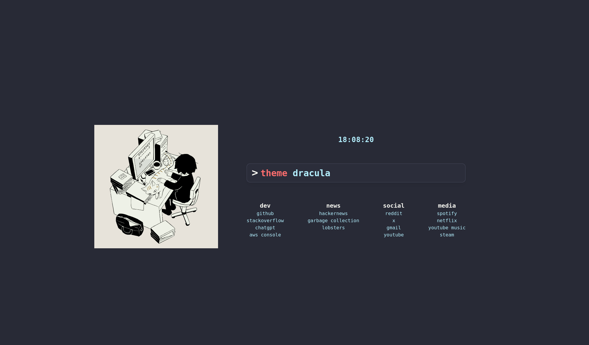
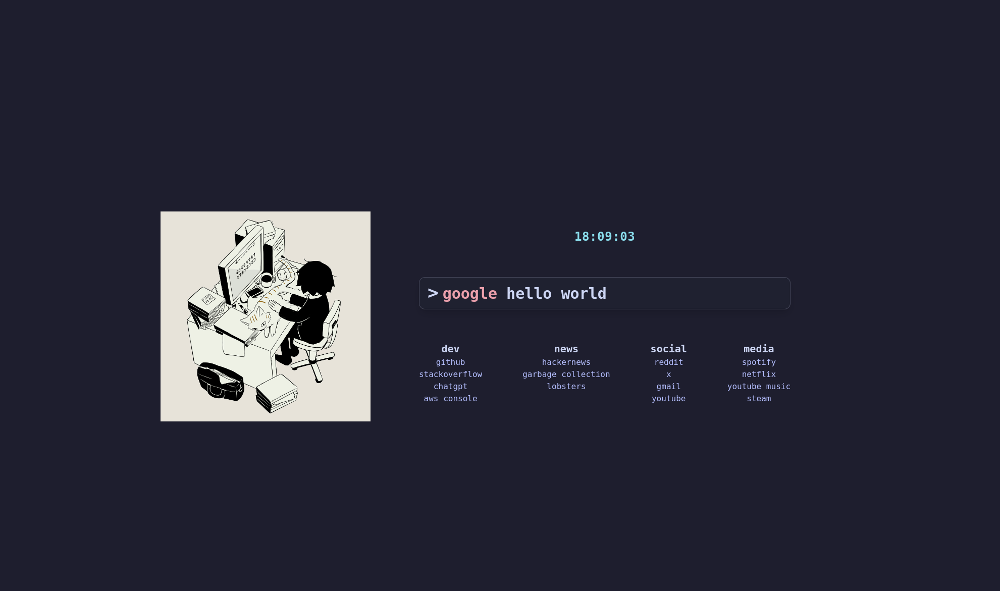
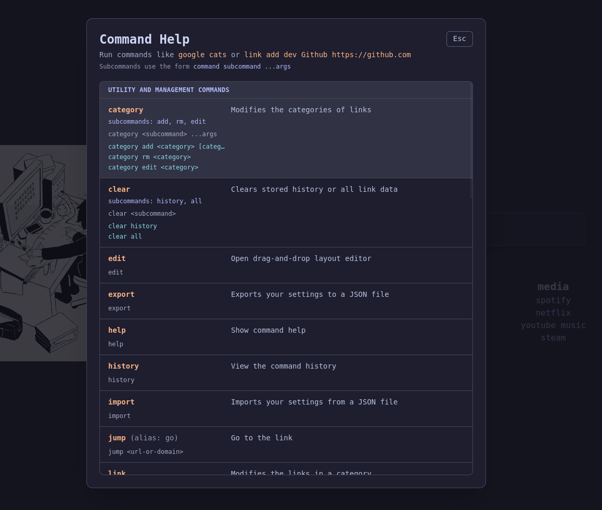
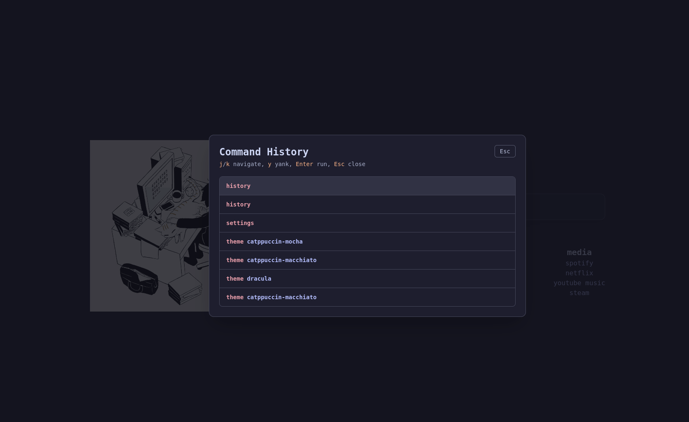
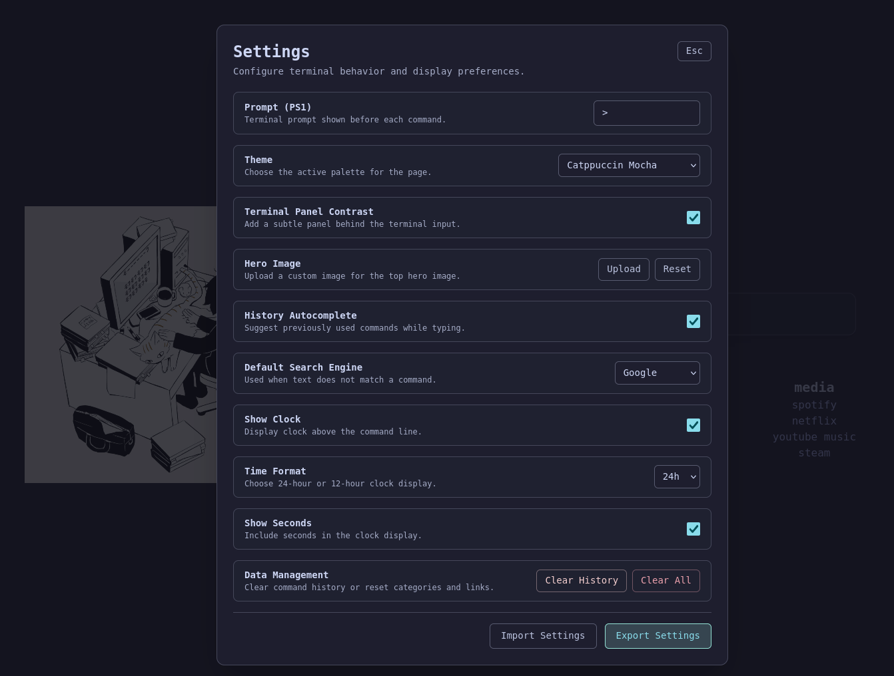
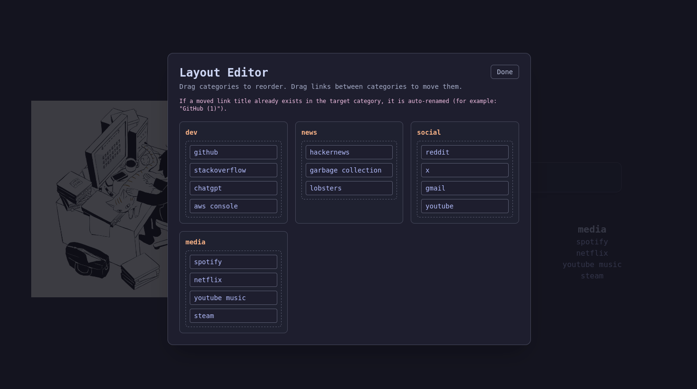
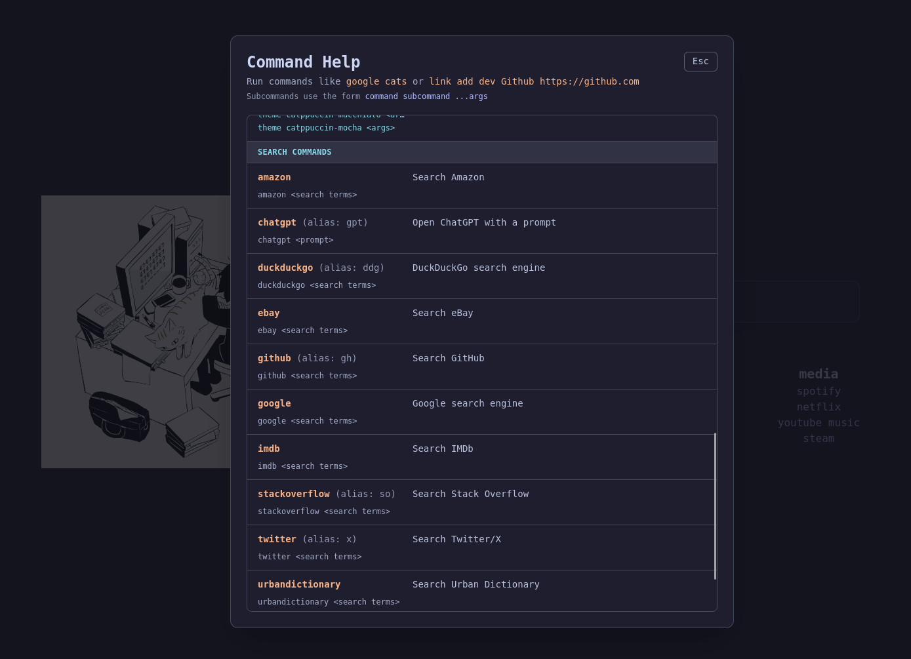

# overview

Minimal browser new-tab page with a terminal-style interface for search, quick links, and settings.

# features

- terminal interface
- clock (due to popular demand)
- themes: gruvbox, catppuccin, ayu, dracula, horizon, zenburn, molokai
- searching popular engines
- history up to 1000 items
- autocomplete across most commands

# screenshots

- main layout: 
- dracula theme: 
- catppuccin theme: 
- help modal: 
- history modal: 
- settings modal: 
- layout editor modal: 
- search command examples: 

# run locally

Install dependencies:

```bash
pnpm install
```

Start dev server:

```bash
pnpm dev
```

Build (type-check + production bundle):

```bash
pnpm build
```

# terminal ux notes

- Normal text-field behavior is preserved (selection, cursor movement, standard text shortcuts).
- `ArrowUp` / `ArrowDown` navigates command history (deduplicated entries).
- `Tab` / `Shift+Tab` cycles autocomplete suggestions and previews the selected suggestion in the input.
- Continue typing to refine/replace the current suggestion.

# commands

Search:

- `google <query>`
- `duckduckgo <query>` (alias: `ddg <query>`)
- `youtube <query>`
- `amazon <query>`
- `github <query>` (alias: `gh <query>`)
- `stackoverflow <query>` (alias: `so <query>`)
- `wikipedia <query>` (alias: `wiki <query>`)
- `twitter <query>` (alias: `x <query>`)
- `imdb <query>`
- `ebay <query>`
- `urbandictionary <query>`
- `chatgpt <prompt>` (alias: `gpt <prompt>`)
- `r/ <subreddit>`
- `jump <url-or-domain>`
- `go <url-or-domain>` (alias of `jump`)

Utility / UI:

- `help` opens help modal
- `history` opens history modal
- `settings` opens settings modal
- `theme <theme-id>` switches theme (autocomplete lists available themes)
- `edit` opens drag-and-drop layout editor modal
- `clear history` clears terminal history
- `clear all` clears history and resets categories/links to defaults
- `ps1 <prompt>` sets terminal prompt text
- `import` imports settings JSON
- `export` exports settings JSON

Category commands:

- `category add <category> [category-url]`
- `category rm <category>` (category autocomplete)
- `category edit <category>` opens rename modal (category autocomplete)

Link commands:

- `link add <category> <title...> <url>`
- `link add` opens add-link modal
- `link rm <category> <title...>` (category + title autocomplete)
- `link edit <category> <title...>` opens edit-link modal (category + title autocomplete)

# theme ids

- `gruvbox-dark`
- `gruvbox-light`
- `ayu-dark`
- `ayu-light`
- `dracula`
- `horizon`
- `zenburn`
- `molokai`
- `catppuccin-latte`
- `catppuccin-frappe`
- `catppuccin-macchiato`
- `catppuccin-mocha`

# settings

Current settings include:

- Theme id
- Terminal panel contrast toggle
- Prompt (`PS1`)
- Default search engine
- History autocomplete toggle
- Show clock
- Time format (`24h` / `12h`)
- Show seconds
- Import / export settings JSON

# deploy to cloudflare pages

Set auth token (or run `wrangler login` once):

```bash
export CLOUDFLARE_API_TOKEN="<your-token>"
```

Deploy with build:

```bash
pnpm deploy:pages
```

Deploy existing `dist` only:

```bash
pnpm deploy:pages:skip-build
```

By default these scripts deploy to Pages project `newtab` and force Cloudflare Pages branch `main` (production). This avoids accidental preview-only deploys when working locally on other branch names (like `master`). To override project name:

```bash
CF_PAGES_PROJECT=my-pages-project pnpm deploy:pages
```

# build extension bundles

Build both browser bundles (unpacked + zip):

```bash
pnpm build:ext
```

Build only Chrome bundle:

```bash
pnpm build:ext:chrome
```

Build only Firefox bundle:

```bash
pnpm build:ext:firefox
```

Outputs:

- Unpacked extension folders: `dist-extension/chrome` and `dist-extension/firefox`
- Zip files: `artifacts/newtab-chrome.zip` and `artifacts/newtab-firefox.zip`

Firefox bundle includes:

- `browser_specific_settings.gecko.id = newtab@kyso.dev`
- `browser_specific_settings.gecko.data_collection_permissions.required = ["none"]`

Build-target defaults:

- Web build defaults: project/downloads links (repo + releases + store placeholders)
- Extension build defaults: dev/news/social/media links
